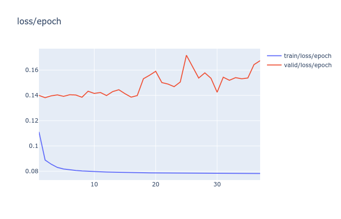
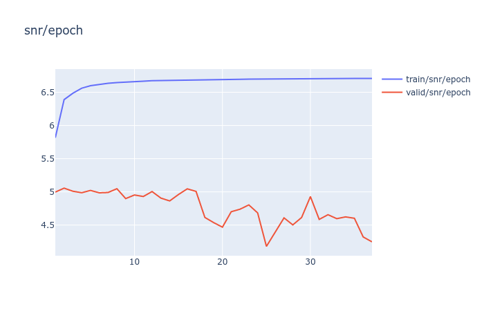

PyTorch + Catalyst implementation of [Looking to Listen at a Cocktail Party](https://arxiv.org/abs/1804.03619).

This repository handles the training process. For inference, checkout the GUI wrapper: [SpeechSeparationUI](https://github.com/RajKhandor/SpeechSeparationUI) in PyQT.

This repository has been merged with [asteroid](https://github.com/mpariente/asteroid) as a [recipe](https://github.com/mpariente/asteroid/tree/master/egs/avspeech).

# Table of Contents
1. [Requirements](#requirements)
2. [Setup](#setup)
3. [Train](#train)
4. [Results](#results)
5. [References](#references)

# Requirements

1. **Computation**

    We ran this program on two GPUs, 1050 Mobile and Tesla V100. We did not conduct any benchmarks but, V100 was roughly 400x faster. It also depends on how much data you download. Hence, **any server grade GPU** should be feasible.

2. **Storage**

    This program does generate a lot of files (download and otherwise). Each audio file is 96kiB in size. For 7k unique audio clips and at a 70/30 train and validation split it occupied  ~120GiB of storage space. Hence, **1TB** minimum if you download more audio clips.
3. **Memory**

    **Minimum of 4GB VRAM** is required. It can handle a batch size of 2.
    At 20 batch size, on two GPUs, it occupied 16GiB VRAM on each GPU. 

# Setup

#### If you are using Docker, just run inside the container:
```bash
./setup.sh && ./install.sh
```

#### Else

1. Setup the directory structure
    ```bash
    ./setup.sh
    ```

2. Install dependencies
    ```bash
    pip install -r requirements.txt
    ```
    Additional dependencies:

    i. ffmpeg
    ii. libav-tools
    ii. youtube-dl
    iii. sox

3. Install
    ```bash
    ./install.sh
    ```
        
During inference
```python
from src import generate_audio, load_model
```

# Run

> Run all these files as scripts.
```bash
cd src/loader
```

> NOTE: Make Sure AVSPEECH dataset is in data/audio\_visual/ folder. Downloading requires a Google account.

### Download the video dataset - <sub><sup>interruptible</sup></sub>


```bash
python3 download.py
```

### Extract sound from the video

Video length can be more than 3 seconds. Hence, extract multiple audio from a single video file.
```bash
python3 extract_audio.py
```

### Mix the audio - <sub><sup>interruptible</sup></sub>

Synthetically mix clean audio. This can take a lot of space of the disk. 96Kb approx for each file.
Total number of files can be: <sup>total_files</sup>C<sub>input_audio_size </sub> for each train and val.
```bash
python3 audio_mixer_generator.py
```

### Remove empty audio

Generating lots of synthetically mixed audio (100+ per second) generates a lot of empty audio files.
Hence, we need to remove the empty audio files.
```bash
python3 remove_empty_audio.py
```

### Convert the path inside the generated dataframe

Path changes from src and src/loader. Both directory has files that need to manipulate
the data/ directory. Hence, create a copy with the correct path in src/loader/
```bash
python3 transform_df.py
```

### Run to cache all embeddings

Create video embedding from all the video files. This will also store video which 
are corrupted. Corrupted video include where face was not detected.
```bash
python3 generate_video_embedding.py
```

### Remove corrupt frames

Hence, remove corrupted video frames as well.
```bash
python3 remove_corrupt.py
```

### Run to cache all spectrograms (optional)

Cache, all the spectrograms
This takes a lot of storage. Tens/Hundreds of GB
```bash
python3 convert_to_spec.py
```

### Train the model - <sub><sup>interruptible</sup></sub>

```bash
python3 train.py --bs 20 --workers 4 --cuda True
```

# Results

Unfortunately, we could not train on a bigger dataset.

### Example Prediction after 37 epochs (Suffering from overfitting)


### Loss Plot


### SNR Plot


# References

1. Looking to Listen at a Cocktail Party: https://arxiv.org/abs/1804.03619
2. Discriminative Loss: https://arxiv.org/abs/1502.04149
3. PyTorch: pytorch.org
4. Catalyst: https://github.com/catalyst-team/catalyst
5. mir_eval: https://github.com/craffel/mir_eval
6. pysndfx: https://github.com/carlthome/python-audio-effects/tree/master/pysndfx
